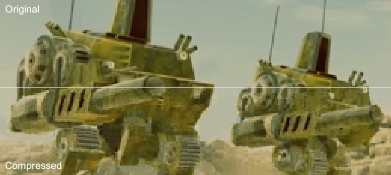

# ClusterVQA

A **VQA Hi-Color** video encoder for *Command & Conquer: Tiberian Sun* and some other Westwood Studios' games.

## Features

- Encodes VQA video files that play in game
- Compresses videos with batched K-means clustering using the [scikit-learn](https://scikit-learn.org/stable/index.html) library
- Automatic scene cut detection
- Written in Python and easily hackable

## How to run it

Install Python 3.8. Then install the required packages:

    pip install -r requirements.txt

Now you can run the encoder with some test data:

    python encoder.py testdata/logo --audio testdata/bleeps_22050_pcm_s16le.raw -ar 22050 video.vqa

You should now see a `video.vqa` file in the working directory. You can view its contents for example by converting it to a lossless MPEG-4 video using a recent version of `ffmpeg` (version 5.0 or newer):

    ffmpeg -i video.vqa -crf 0 video.mp4

### Advanced use

Run `python encoder.py --help` to see all the encoder parameters and their default values.

## Convert video to an image sequence

Only PNG image sequences are supported. Use `ffmpeg` to convert and downscale your video to a bunch of PNG files:

    ffmpeg -i inputvideo.mp4 -filter:v "scale=640:-1" "frames/frame%04d.png"

Now you should have files `frames/frame0001.png`, `frames/frame0002.png` and so on. Then you can run the encoder:

    python encoder.py frames video.vqa
 
## Sound

Only PCM audio is supported. Convert your soundtrack beforehand:

    ffmpeg video.mp4 -f s16le -c:a pcm_s16le -ar 44100 audio.raw

Then use it with `--audio audio.raw` and `-ar 44100` command line arguments.

## Gotchas

- **It's slow.** Roughly one second per 640x400 pixel frame.
- Only PCM audio is supported.
- Scene cut detection heuristics may produce too many keyframes.
- Only tested on Windows 10.
- Westwood LCW and VPRZ compression are done with fast & loose implementations resulting in larger files.
- VQA videos with 8-bit palettes for *Command & Conquer: Red Alert* are not supported.

## Development

Run the test suite with

- `python run_tests.py`: by default it only runs two end-to-end integration tests,
- `run_tests.py all` runs also unit tests and
- `run_tests.py visual` shows encoder results visually.

Source code is formatted with the [Black](https://black.readthedocs.io/en/stable/index.html) formatter's default settings by running `black .` in the repository root.

See `docs/how_it_works.py` for an explanation of the core vector quantization concept.

Manual end-to-end test with the `pickle` decoder:

    mkdir testoutput
    python encoder.py testdata/logo --audio testdata/bleeps_22050_pcm_s16le.raw -ar 22050 --encoder pickle logo.pickle
    python pickle_decoder.py logo.pickle testoutput

Then visually inspect the images in the `testoutput/` directory.

## Credits

Thanks to CCHyper, tomsons26, OmniBlade and UGordan for VQA file format info.
Header comparison image is a frame from [*Renegade X: Tiberian Sun X*](https://www.youtube.com/watch?v=x6loeCpRBZ4) trailer by Totem Arts.
The [`rodents.png` test file](https://peach.blender.org/wp-content/uploads/rodents.png): (c) copyright 2008, Blender Foundation / www.bigbuckbunny.org and used under the Creative Commons Attribution 3.0 license. 

## License

GPLv3. See `LICENSE` file.